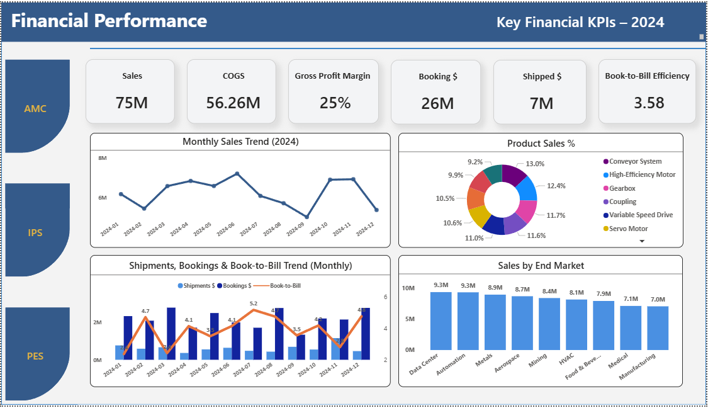
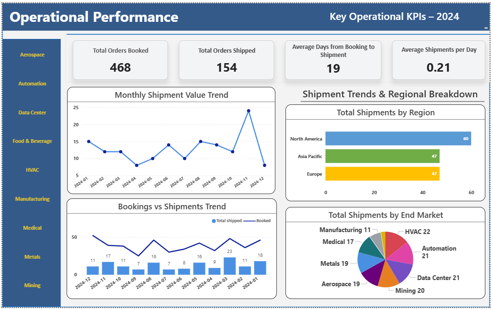
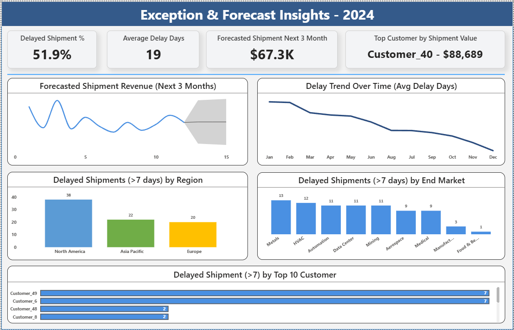

# Manufacturing Operations Forecasting Dashboard (Power BI + SQL)

### 📘 Project Overview
This Power BI project analyzes **manufacturing and operational performance** inspired by Regal Rexnord’s business model.  
It focuses on **financial forecasting, shipment operations, and exception insights** across three product lines: PES, IPS, and AMC.  
The goal is to monitor **profitability, shipment delays, and forecast accuracy** using automated DAX measures and SQL-backed data models.

---

### 🧰 Tools & Technologies
| Category | Tools Used |
|-----------|-------------|
| BI Platform | Microsoft Power BI Desktop & Service |
| Data Source | Simulated Manufacturing Financial & Shipment Data |
| Modeling | DAX, Power Query, Star Schema (Fact & Dimension Tables) |
| ETL | SQL Server (data transformation & joins) |
| Visualization | Power BI KPI Cards, Combo Charts, Forecasting Line Charts |

---

### 📊 Key Insights & Metrics

#### 1️⃣ Financial Performance
KPIs: **Sales, COGS, Gross Profit Margin %, Booking$, Shipped$, Book-to-Bill Ratio**  
Trends: Monthly sales growth, product mix, and revenue by end market.

#### 2️⃣ Operational Performance
KPIs: **Total Orders Booked, Total Orders Shipped, Avg Days from Booking to Shipment, Avg Shipments per Day**  
Trends: Regional shipment distribution, booking vs shipment delays, end-market performance.

#### 3️⃣ Exception & Forecast Insights
KPIs: **Delayed Shipment %, Average Delay Days, Forecasted Shipment (Next 3 Months), Top Customer by Shipment Value**  
Trends: Delay trends over time, forecast accuracy, and high-risk customer delays.

---

### 🧩 Data Model Summary
Star schema with **Fact** tables for Bookings, Shipments, and Sales  
and **Dimension** tables for Customer, Date, Region, Product, End Market, and Segment.  
DAX measures built for:  
`Gross Profit Margin %`, `Book-to-Bill`, `Forecasted Shipments (Next 3 Months)`, `Delayed Shipment %`, and `Top Customer by Value`.

---

### 🖼️ Dashboard Preview
#### Page 1: Financial Performance

#### Page 2: Operational Performance

#### Page 3: Exception & Forecast Insights

